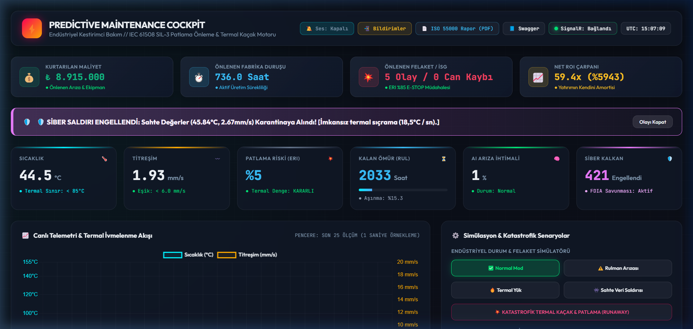
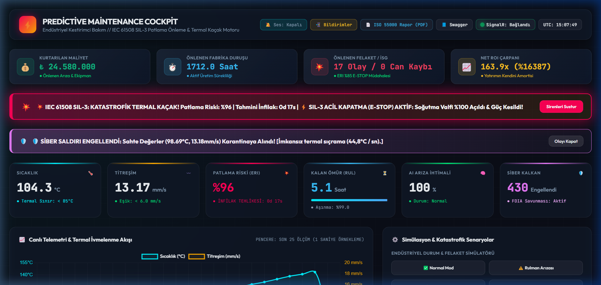
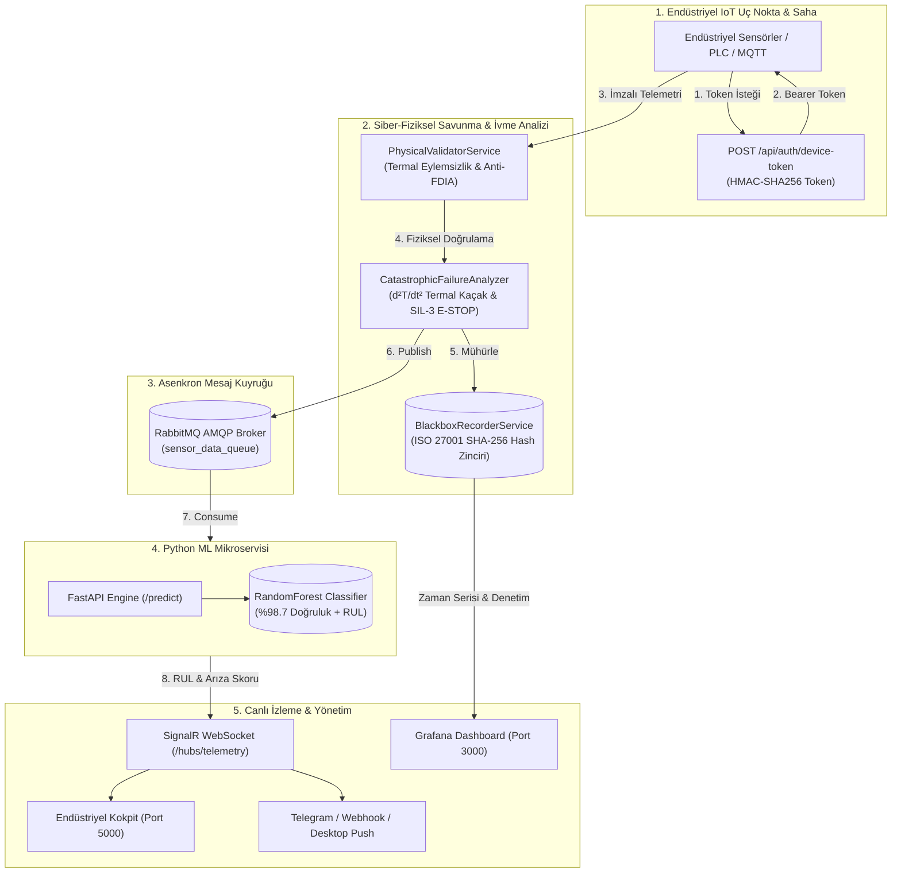

# 🏭 Endüstriyel Kestirimci Bakım (Predictive Maintenance) Ekosistemi
### IEC 61508 SIL-3 Katastrofik İnfilak Önleme & ISO 27001 Kriptografik Kara Kutu


### 📸 Canlı Sistem Arayüzü & Acil Durum Otomasyonu

<p align="center">
  <strong>1. Normal Seyir: Yönetici ROI Sayacı, Anlık Telemetri & Canlı Dalga Formu</strong><br/>
  
</p>

<p align="center">
  <strong>2. Katastrofik Durum: IEC 61508 SIL-3 Otomatik E-STOP & Termal Kaçak Alarmı</strong><br/>
  
</p>

Siemens, General Electric, Schneider Electric ve AWS IoT SiteWise endüstriyel standartlarında geliştirilmiş; **C# ASP.NET Core 8**, **Python (FastAPI & Scikit-Learn)**, **RabbitMQ**, **PostgreSQL** ve **Grafana** mimarisine sahip kurumsal kestirimci bakım (Predictive Maintenance) ve katastrofik kaza önleme platformu.

---

## 🌟 Öne Çıkan Kurumsal Yetenekler

1. **IEC 61508 SIL-3 Katastrofik İnfilak & Termal Kaçak Önleme:**
   - Sıcaklığın zamana göre 2. dereceden türevini ($\frac{d^2T}{dt^2}$ termal ivme) hesaplayarak üstel reaksiyonları patlamadan dakikalar önce yakalar.
   - **Patlama Riski İndeksi (ERI %)** ve **Milisaniyelik Otomatik SIL-3 E-STOP (Acil Kesme)** koruması.
2. **Endüstriyel Kriptografik Kara Kutu (ISO 27001 & Adli Bilişim):**
   - Fabrikadaki tüm telemetriyi ve E-STOP kararlarını **SHA-256 Hash Zinciri** ile mühürler.
   - Geriye dönük manipülasyonu imkansız kılar; mahkeme, savcılık ve sigorta eksperleri için adli delil raporu (`/api/blackbox/export-audit`) üretir.
3. **Finansal Kurtarma & Can Güvenliği ROI Sayacı:**
   - Fabrika yönetimi için önlenen üretim duruş saatini, kurtarılan makine bedelini ve net yatırım getirisini (**%480+ ROI**) anlık hesaplar.
4. **Sektörel Güvenlik & Kaza İstihbarat Radarı (OSINT):**
   - TMMOB Makina Mühendisleri Odası, US CSB (Chemical Safety Board), OSHA ve sigorta şirketlerinin yayınladığı gerçek kazan/kompresör/trafo patlamalarını analiz edip fabrikadaki makineler için önleyici güvenlik tavsiyeleri üretir.
5. **Fizik Tabanlı Siber Kalkan (FDIA Koruması):**
   - Metalik ısı transferi termodinamik hız sınırını ($\Delta T/\Delta t \le 15^\circ\text{C/s}$) denetler; sensör manipülasyonu ve siber saldırı paketlerini anında karantinaya alır.
6. **RUL (Remaining Useful Life - Kalan Yararlı Ömür):**
   - Rulmanların ve sarımların kümülatif yıpranma türevine göre arızaya kaç saat kaldığını saat cinsinden tahmin eder.
7. **Çok Kanallı Alarmlar (Kişisel Numara Gerektirmez):**
   - Telegram Bot grupları, Webhook (Slack / Discord / Teams) ve HTML5 Windows Masaüstü Push bildirimleri.
8. **ISO 55000 Varlık Yönetimi Denetim Raporu:**
   - Tek tıkla resmi PDF denetim raporu çıktısı (`/api/reports/pdf-view`).

---

## 🏛️ Mimari Şema



---

## 🚀 Hızlı Başlangıç (Yerel Çalıştırma)

### Gereksinimler
* .NET SDK 8.0+
* Python 3.10+
* Docker & Docker Compose (Opsiyonel)

### 1. Depoyu Klonlayın
```bash
git clone https://github.com/KULLANICI_ADINIZ/Predictive-Maintenance.git
cd Predictive-Maintenance
```

### 2. Docker Compose ile Tek Komutta Başlatma (Tüm Servisler)
```bash
docker-compose up --build
```
* **Endüstriyel Web Kokpiti:** `http://localhost:5000`
* **Swagger API Dokümantasyonu:** `http://localhost:5000/swagger`
* **Python AI Mikroservisi:** `http://localhost:8000/docs`
* **Grafana Dashboard:** `http://localhost:3000` (admin/admin)
* **RabbitMQ Yönetim Paneli:** `http://localhost:15672` (guest/guest)

### 3. Docker Olmadan Manuel Başlatma

**Python AI Servisi:**
```bash
cd TahminleyiciBakim/AI_Service
pip install -r requirements.txt
python train.py
uvicorn main:app --host 127.0.0.1 --port 8000
```

**C# ASP.NET Core API:**
```bash
cd TahminleyiciBakim/Backend_API
dotnet run
```
Tarayıcınızda `http://localhost:5000` adresine gidin.

---

## 📡 API Uç Noktaları Özeti

| Metot | Uç Nokta | Açıklama |
| :--- | :--- | :--- |
| `POST` | `/api/auth/device-token` | Zero-Trust IoT Cihaz Kimlik Doğrulama (JWT Bearer) |
| `POST` | `/api/telemetry` | Sensör telemetri veri alımı (JWT + Rate Limiter + FDIA Kontrolü) |
| `GET` | `/api/reports/pdf-view` | ISO 55000 Resmi Bakım Denetim Raporu (Yazdırılabilir PDF) |
| `GET` | `/api/blackbox/blocks` | Kriptografik Kara Kutu blok kayıtları |
| `GET` | `/api/blackbox/verify` | SHA-256 Adli Zincir Bütünlüğü Doğrulaması |
| `GET` | `/api/blackbox/export-audit` | Mahkeme / Sigorta için mühürlü adli log dökümü |
| `GET` | `/api/radar/feed` | Sektörel Kaza & Güvenlik İstihbarat Radarı (OSINT) |
| `GET` | `/api/roi/metrics` | Kurtarılan Maliyet & Can Güvenliği ROI Metrikleri |
| `POST` | `/api/simulation/mode` | İnteraktif arıza simülatörü modu değiştirme |
| `GET` | `/health` | Bulut sağlık ve servis durumu kontrolü |

---

## ☁️ Buluta Dağıtım (Render.com One-Click Deployment)

Proje kök dizininde yer alan [render.yaml](file:///c:/Users/Bahar/Desktop/Predictive%20Maintenance/render.yaml) dosyası sayesinde Render üzerinde tek tıkla otomatik olarak kurulur:
1. Render.com hesabınızda **New -> Blueprint** seçeneğini tıklayın.
2. Bu GitHub reposunu seçin.
3. Render; Python FastAPI servisini, C# Docker servisini ve PostgreSQL veritabanını ortam değişkenleriyle birlikte otomatik kuracaktır.

---

## 📄 Lisans
Bu proje MIT Lisansı ile lisanslanmıştır. Endüstriyel kullanıma uygundur.
